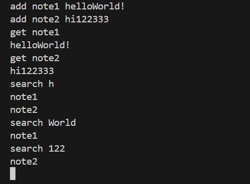

# Drive-Project (Client-Server Architecture)
Message to the Checker:
 - all the code from the second excercise is in the ex3 branch:
```bash
 git checkout ex3
 ```

## How to Run (with Docker Compose)
We use Docker Compose to manage the multi-container setup. This ensures the Web Server and the C++ Server run as separate processes but can communicate over a virtual bridge network.

from the root directory (/Drive-Project), run:

### 1. Build and Start the System
This command builds the images and starts both servers in the background.
```bash
docker-compose up --build -d server web-server
```

### 2. Access the API
The Web Server is exposed on `http://localhost:5000`. 
You can use `curl` to interact with the endpoints defined in `web-server/routes/api.js`.

### 3. Run the Unit Tests
To run the automated test suite (Google Test) in an isolated container:
```bash
docker-compose run --rm tests
```

### 4. Stop and Clean Up
To stop the server and remove the containers:
```bash
docker-compose down
```

## Execution Example
in the image we can see the server in the right terminal, and the two in the left are the cpp-client and the python-client, which are both being served simultaniousely

