# Demos
Here is a guide on how to use the main features of the system and see the synchronization in action.

# Web client
## 1. Register & Login
### Register
Open your browser and go to `http://localhost:3000`.
Click on the "Register" button.
Enter a username and password to create a new account.

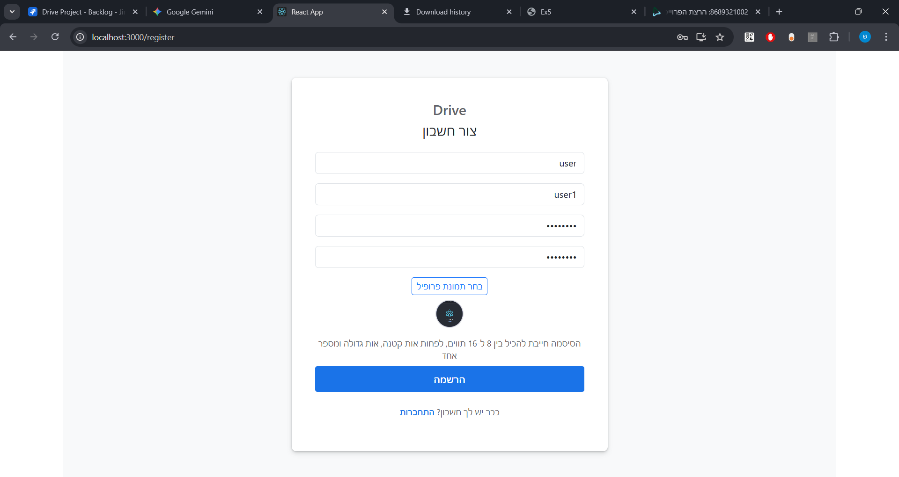

### Login
Enter the same username and password you just created.
Tap "Login".

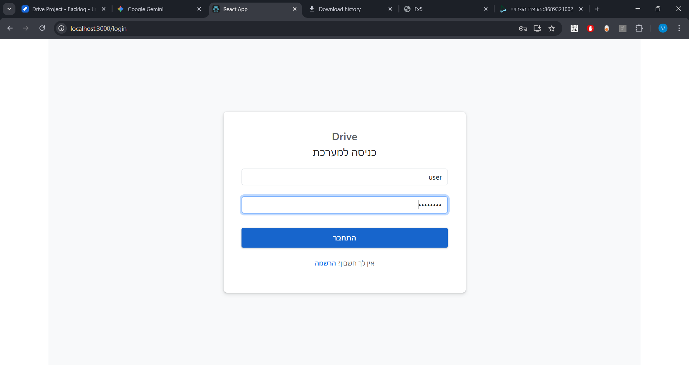

### Home page after successful login
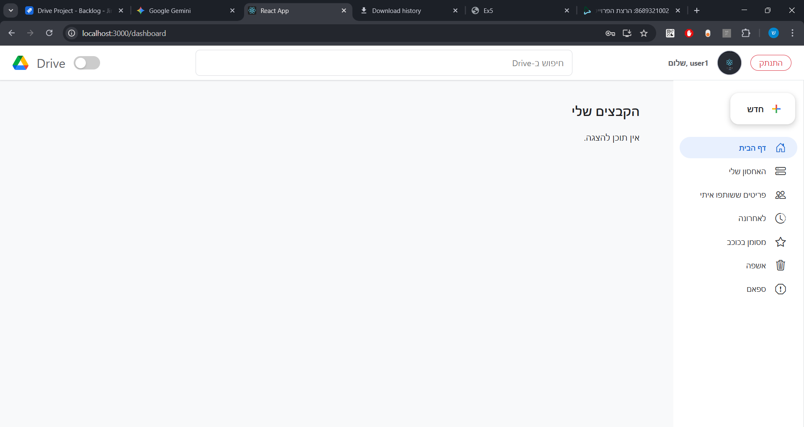

## 2. File Actions
### Upload resources
| Create Menu | Uploaded Resources |
| :---: | :---: |
| 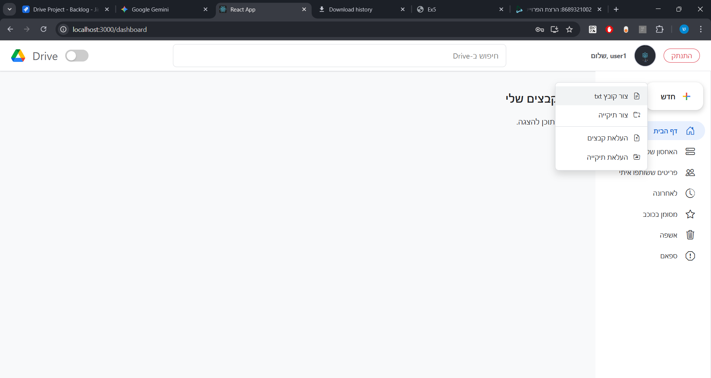 | 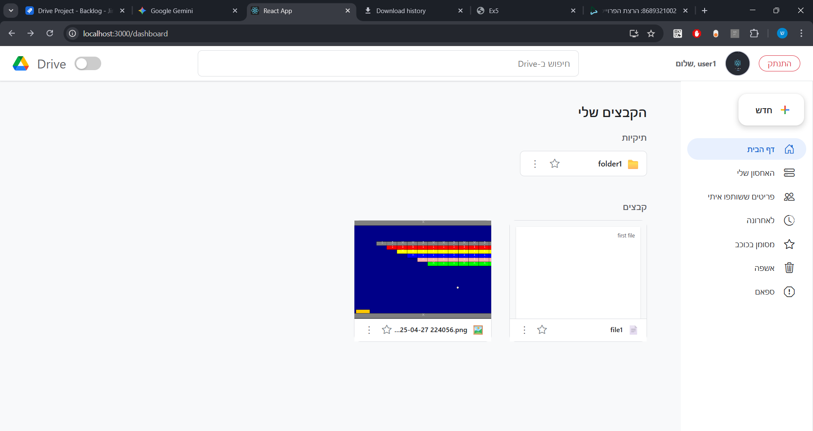 |

### edit the File
you can also rename / change image if you have at least writer permissions.
this is an example of editing a txt file's content:
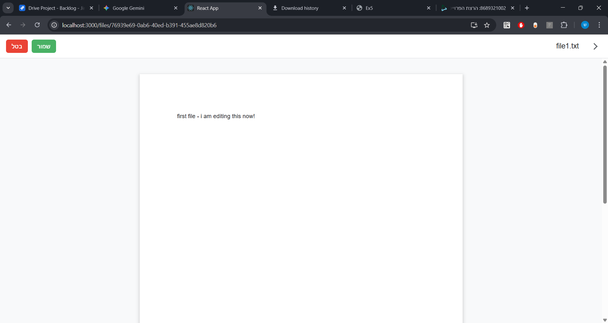

### Delete a File
Click the Delete button in the actions menu of a resource.

| Action | Result |
| :---: | :---: |
| 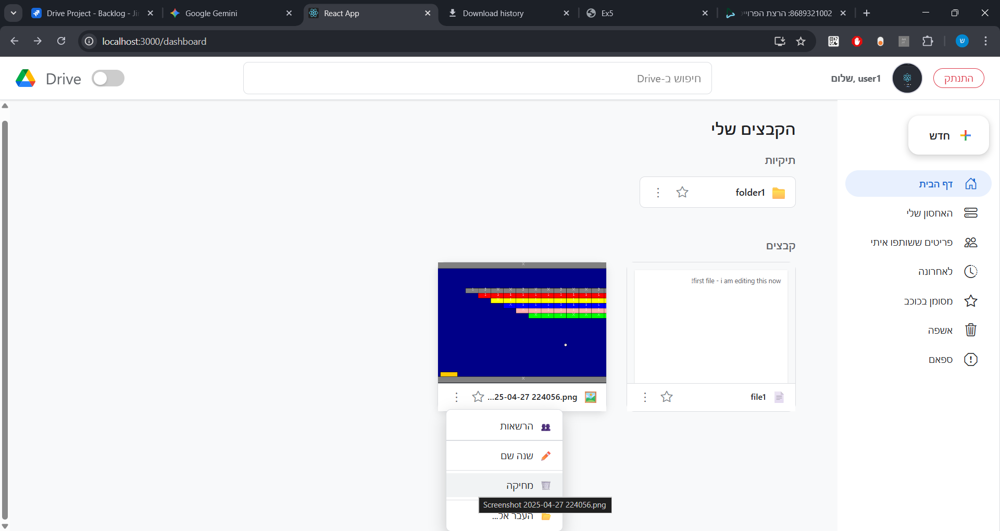 | 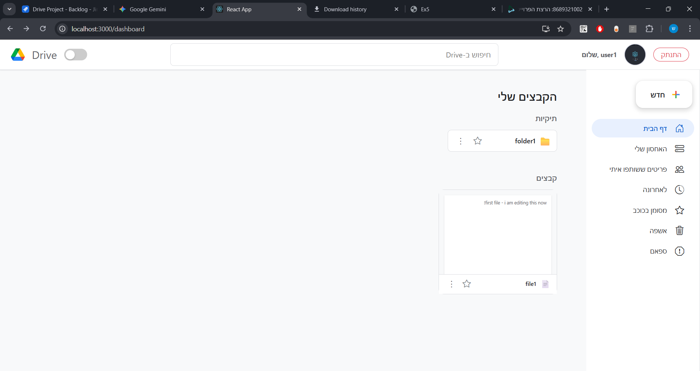 |

# Native client
## 1. Register & Login
### Register
Open the expo app on your phone or an emulator where the clientMobile is running.
Click on the "Register" button.
Enter a username and password to create a new account.
> **⚠️**notice my iphone's screenshots hide the dots of the password for some reason

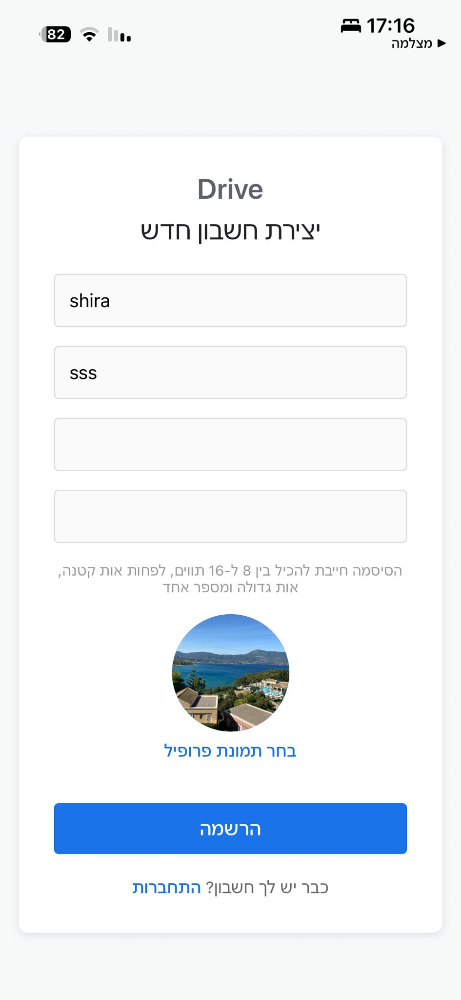

### Login
Enter the same username and password you just created.
Tap "Login".

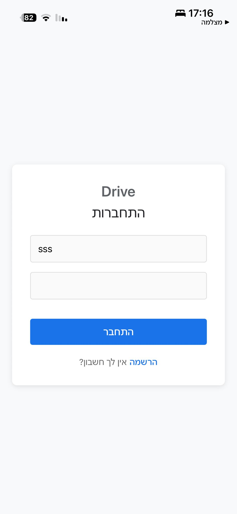

### Profile page

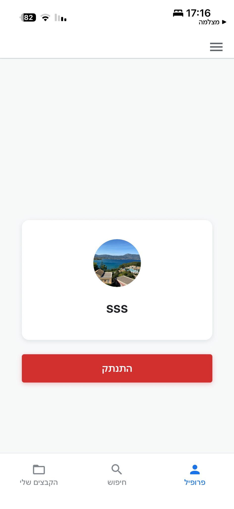

## 2. File Actions
### Upload resources

| Create Menu | Home Page |
| :---: | :---: |
| 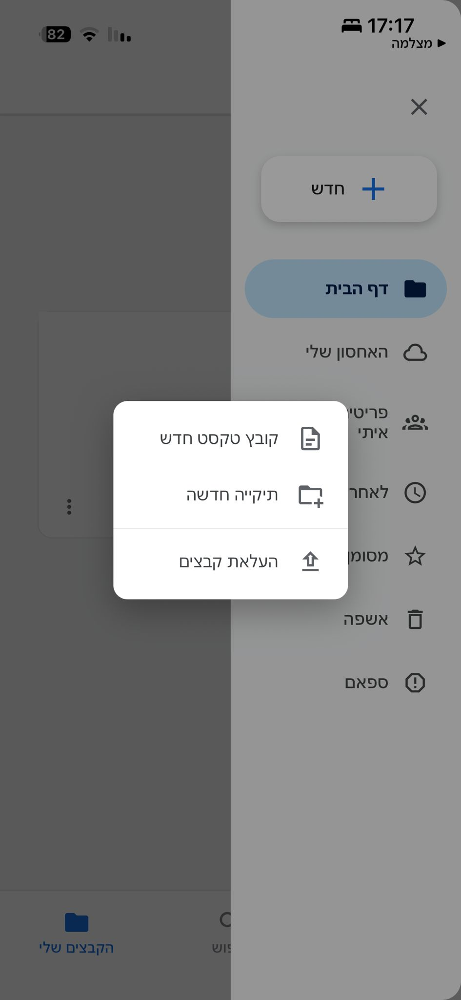 | 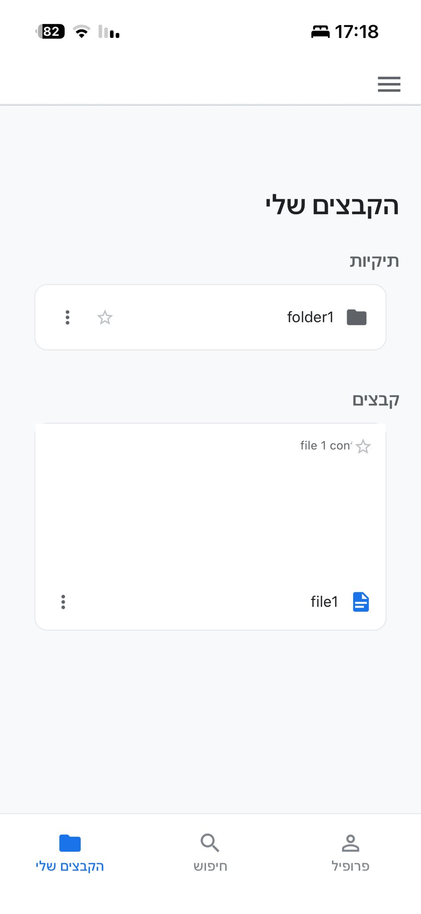 |

### edit the File
you can also rename / change image if you have at least writer permissions.
this is an example of editing a txt file's content:

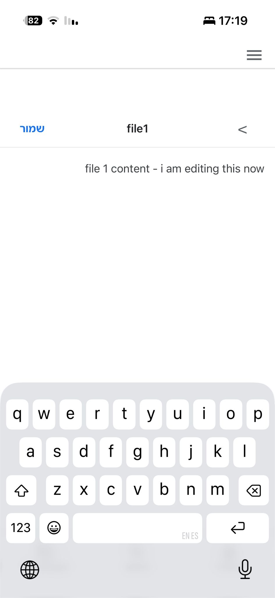

### Delete a File
Click the Delete button in the actions menu of a resource.

| Action | Result |
| :---: | :---: |
| 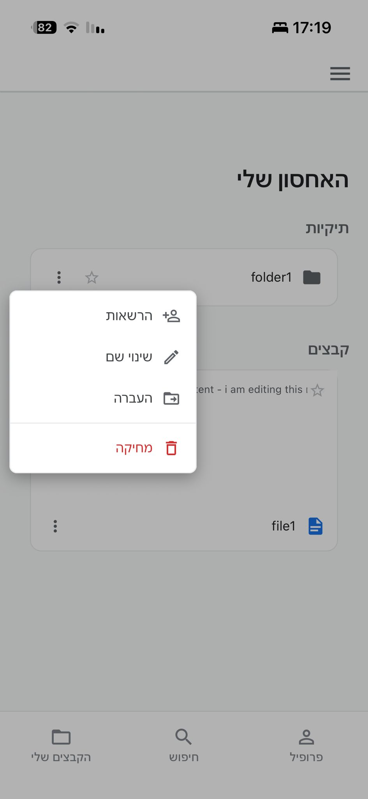 | 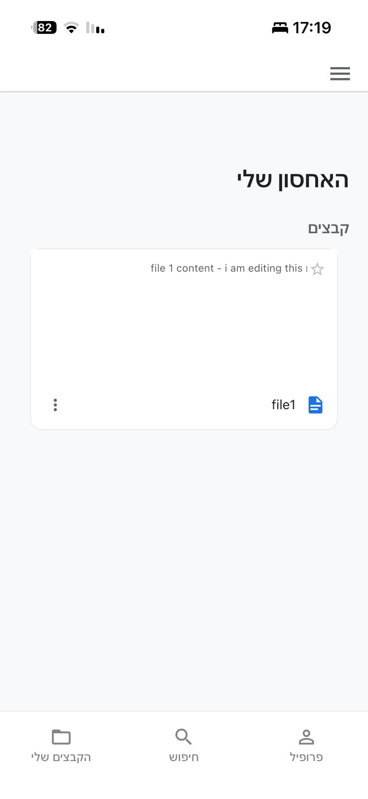 |